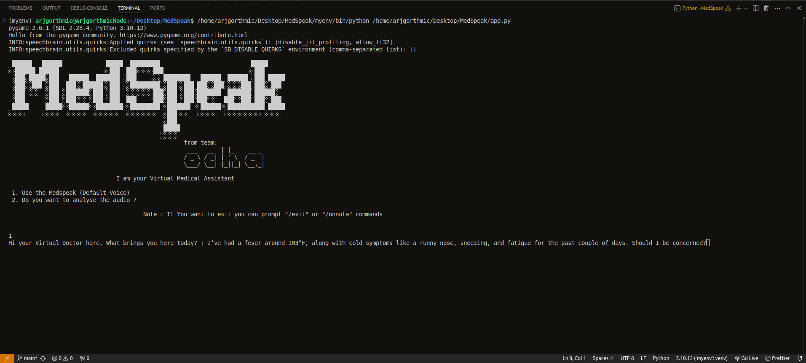

# MedSpeak

MedSpeak is an AI-driven medical assistance tool. The platform provides accurate, evidence-based medical information, treatment options, and diagnostic insights.
It can Analyse the users sound to analyse and provide users better result afer diagnosing.
## Usage

Step 1 :
```bash
pip install -r requirements.txt
```
Step 2 :
```bash
python3 app.py
```
Now prompt to MedSpeak, it will help you 
## Screenshots




## Developers

- [@Aleena24](https://github.com/Aleena24)
- [@Arjgorithmic](https://github.com/Arjgorithmic)
- [@Sneha-Pulse](https://github.com/Sneha-Pulse)


 
 
 

 MedSpeak is built to assist, not replace, human judgment in healthcare. It emphasizes concise, accurate communication and stresses that its advice complements, rather than substitutes, professional medical expertise. 
